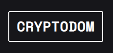

<div align='center'></div>

# Cryptodom

CryptoDom is a crypto themed website that allows users to view up-to-date information about various cryptocurrencies. The website is designed to provide users with a "snapshot" of current key metrics of cryptocurrencies. The website uses the Coingecko API, which is a well-known source for cryptocurrency data.

## Tech Stack

**Client:** React, vanilla CSS

## Screenshots


## Installation

To install the required dependencies, simply run the following command in the project's root directory:

```bash
  npm install
```

## Usage

To start the development server, run the following command:

```bash
  npm start
```

The application will be available at http://localhost:3000
